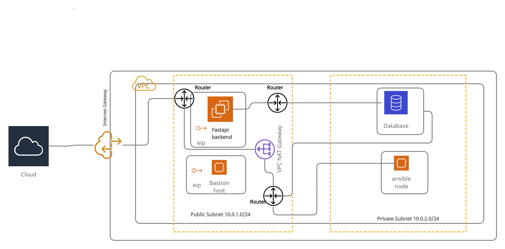

# **Building a two tier infrastructure with Terraform in AWS**
## *This is a simple two tier infrastructure deployment into AWS*
#### Table of Contents
---
* [General info](#general-info)
* [Technologies](#technologies)
* [Setup](#setup)

## General info
---
This project is a simple example of how deploying infrastructure with Terraform is easy and powerful. In this project I deployed 3 instances for
my FastAPI, Bastion server, Ansible control node and a PostgreSQL database.

## Technologies
---
Project is created with:
* Terraform: version 0.13
* AWS CLI: version 2
* Bash Script
* YAML script for Ansible

---
To run this project you will need to carry out the following steps:

Setup an AWS free tier account if you don't have one
Install [Terraform's CLI](https://www.terraform.io/downloads.html)
Install [AWS CLI](https://docs.aws.amazon.com/cli/latest/userguide/cli-chap-install.html)
Get your aws_access_key
Get your aws_secret_key

## Illustration
---
The below describes our infrastructure

## Key things to note
---
* After deploying this infrastructure you should be able to access all instances in the public subnet.
* The only way to access Ansible instance and Database is by first SSH into Bastion server and going in from there by SSH.
* You will want to share your key with the servers beyond the Bastion. I suggest;
        - doing a "ssh-keygen" in the Bation server
        - running "$ssh-copy-id -i ~/.ssh/YOUR_KEY user@host"

## Project Status
---
This project is just the first part. I plan to dockerize an app in this infrastructure and hit it over the web. Trying to tidy the api endpoints up. I'll upload once done

## Inspiration
---
Boredom was my biggest inspiration😅. Just kidding. My bud https://github.com/4bdu1 set me off on this part of self discovery. It's been fun so far besides the night I ripped my hair out.
